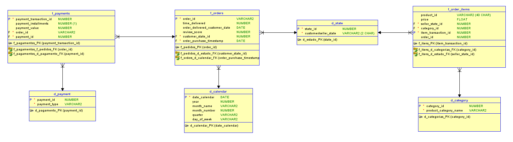
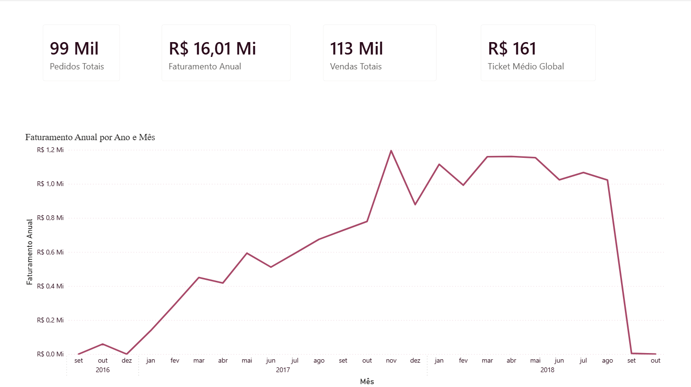
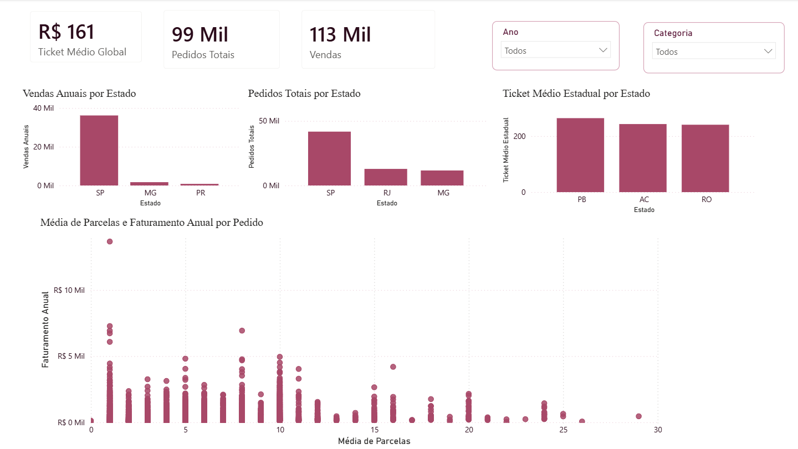
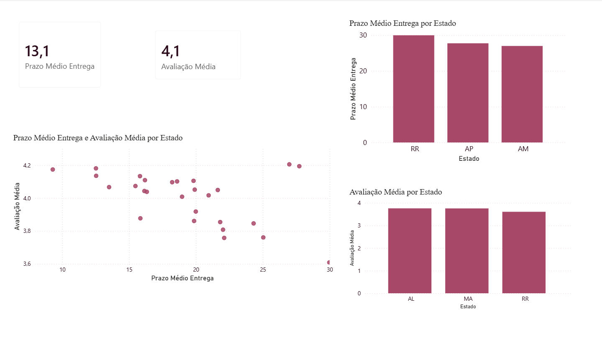

# Olist E-Commerce Analysis

Análise end-to-end do maior dataset público de e-commerce brasileiro, cobrindo pipeline ETL, modelagem dimensional Star Schema e dashboard interativo no Power BI.

**Autora:** Thayná Lopes  
**Stack:** Python · Pandas · Seaborn · Power BI · Oracle Data Modeler

---

## Sobre o projeto

O dataset público da Olist contém mais de 100 mil pedidos realizados entre 2016 e 2018 em marketplaces brasileiros. Este projeto transforma 9 CSVs brutos em um modelo dimensional Star Schema e responde perguntas de negócio reais sobre comportamento de clientes, logística e vendas.

---

## Dataset

**Fonte:** [Brazilian E-Commerce Public Dataset by Olist — Kaggle](https://www.kaggle.com/datasets/olistbr/brazilian-ecommerce)

| Tabela original | Descrição |
|-----------------|-----------|
| olist_orders_dataset | Ciclo de vida dos pedidos |
| olist_order_items_dataset | Itens por pedido |
| olist_order_payments_dataset | Transações de pagamento |
| olist_order_reviews_dataset | Avaliações dos clientes |
| olist_customers_dataset | Dados dos clientes |
| olist_sellers_dataset | Dados dos vendedores |
| olist_products_dataset | Catálogo de produtos |

---

## Modelagem dimensional — Star Schema

O modelo foi projetado no Oracle Data Modeler antes da implementação em Python,
garantindo que relacionamentos, cardinalidades e granularidades fossem definidos
antes de qualquer linha de código.



| Tabela | Tipo | Granularidade |
|--------|------|---------------|
| `f_orders` | Fato | Um pedido por linha |
| `f_order_items` | Fato | Um item por linha |
| `f_payments` | Fato | Uma transação de pagamento por linha |
| `d_state` | Dimensão conformada | Estados de clientes e vendedores |
| `d_category` | Dimensão | Categorias de produto |
| `d_payment` | Dimensão | Métodos de pagamento |
| `d_calendar` | Dimensão | Calendário criado via DAX no Power BI |

---

## Tratamentos realizados

| Problema encontrado | Decisão tomada |
|---------------------|----------------|
| Colunas de data lidas como string | Convertidas para datetime com `pd.to_datetime` |
| Registros fantasma em `df_products` — apenas `product_id` preenchido | Removidos antes de criar `d_category` |
| Pedidos com múltiplas avaliações em `df_reviews` | Agregados por `order_id` com média de `review_score` |
| Pedidos com múltiplos métodos de pagamento | `f_payments` modelada com granularidade de transação — uma linha por evento |
| `customer_id` não identifica o cliente real | Usado `customer_unique_id` para análises de comportamento por cliente |
| Itens sem categoria em `f_order_items` | Nulos mantidos — produtos sem categoria existem no catálogo original |
| `time_delivered` com valores decimais | Arredondado para cima com `np.ceil` — do ponto de vista do cliente, 8.1 dias equivalem a 9 dias |
| `review_score` com valores decimais após agregação | Arredondado para inteiro antes de agrupar por nota |

---

## Principais insights

- **SP concentra 42% dos pedidos** mas não lidera em ticket médio — estados com menor volume como PB, AC e RO apresentam ticket médio até 60% maior
- **Correlação negativa confirmada (-0.33)** entre prazo de entrega e avaliação — RR apresenta o maior prazo médio (30 dias) e a pior avaliação média simultaneamente
- **Agosto é o mês de pico de pedidos**, não novembro — o comportamento sazonal do e-commerce brasileiro difere do padrão americano
- **A hipótese de que alto valor gera mais parcelas foi refutada** — a maioria das transações tem menos de 10 parcelas independente do valor pago, sugerindo que parcelamento sem juros é o driver principal
- **cama_mesa_banho é a categoria mais vendida** com 11.115 itens, seguida de esporte_lazer e informatica_acessorios

---

## Dashboard Power BI

Três páginas analíticas com segmentadores de ano e categoria sincronizados.

**Página 1 — Visão Geral**


**Página 2 — Clientes e Pagamentos**


**Página 3 — Logística e Avaliações**


---

## Estrutura do repositório

```
olist-ecommerce-analysis/
├── data/
│   ├── raw/          ← CSVs originais (não versionados — ver instruções abaixo)
│   └── processed/    ← Parquets gerados pelo ETL
├── notebooks/
│   ├── 01_exploracao.ipynb
│   ├── 02_tratamento.ipynb
│   └── 03_analise.ipynb
├── dashboard/
│   └── olist_dashboard.pbix
├── docs/
│   └── prints/
│       ├── modelo_relacional.png
│       ├── pagina_1.png
│       ├── pagina_2.png
│       └── pagina_3.png
├── requirements.txt
└── README.md
```

---

## Como executar

**1. Clone o repositório**
```bash
git clone https://github.com/thayna-data-portfolio/olist-ecommerce-analysis.git
cd olist-ecommerce-analysis
```

**2. Instale as dependências**
```bash
pip install -r requirements.txt
```

**3. Baixe o dataset**

Acesse [este link do Kaggle](https://www.kaggle.com/datasets/olistbr/brazilian-ecommerce), baixe e extraia os CSVs para `data/raw/`.

**4. Execute os notebooks em ordem**
```
01_exploracao.ipynb   ← entendimento dos dados
02_tratamento.ipynb   ← ETL e geração dos Parquets
03_analise.ipynb      ← análise exploratória e visualizações
```

**5. Abra o dashboard**

Abra `dashboard/olist_dashboard.pbix` no Power BI Desktop.

---

## Tecnologias


---

## Decisões de arquitetura

**Por que Parquet?** Formato colunar comprimido — mais eficiente para leitura analítica do que CSV, especialmente no Power BI com grandes volumes.

**Por que Star Schema?** O modelo dimensional separa métricas (tabelas fato) de contexto (dimensões), permitindo medidas DAX corretas e filtros que propagam sem ambiguidade.

**Por que `d_state` é conformada?** Estado do cliente está em `f_orders` e estado do vendedor em `f_order_items` — uma única dimensão compartilhada elimina redundância e garante consistência nas análises geográficas.

**Por que `f_payments` é uma tabela fato separada?** Um pedido pode ter múltiplos métodos de pagamento. Manter pagamentos em `f_orders` criaria linhas duplicadas e distorceria métricas de faturamento e ticket médio.

